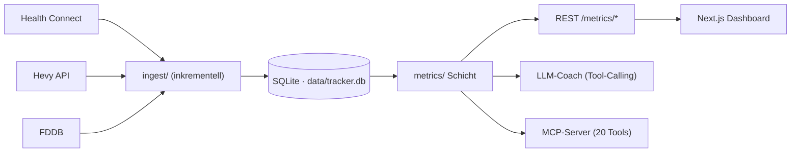

<p align="center">
  
</p>

<h1 align="center">Milon</h1>

<p align="center">
  <strong>Persönliches, lokal laufendes Fitness-Dashboard mit LLM-Coach.</strong><br>
  Eine Frage im Zentrum: <em>„Wo werde ich besser, wo schlechter?"</em>
</p>

<p align="center">
  
  
  
  
  
</p>

---

Milon zieht deine Fitnessdaten an **einem** Ort zusammen — Health Connect (Körper, Schritte,
Laufen, Rad), **Hevy** (Krafttraining) und **FDDB** (Ernährung) — und beantwortet die eine Frage,
die zählt: *werde ich besser oder schlechter?* Alles läuft **lokal** auf dem eigenen Rechner,
Gesundheitsdaten verlassen die Maschine nie. UI deutsch, Code englisch. Bewusst schlank.

<p align="center">
  
</p>

## Was drin ist

| Bereich | Highlights |
|---|---|
| **Übersicht** | Wochenvergleich (rollierende 7 Tage), GitHub-Style Konsistenz-Heatmap + Streak, PR-Trophäen, letzte Aktivitäten |
| **Körper** | Gewichts-/KFA-Trends (roh · 7-Tage · EWMA), **adaptives TDEE** (14-Tage-geglättet), Magermasse/Recomp, Komposition-Prognose |
| **Ernährung** | kcal **+ Makros** (Protein/KH/Fett), Protein Ø/Tag vs. Ziel, Defizit vs. TDEE |
| **Gesundheit** | Schritte (nur Galaxy Watch), Radfahren |
| **Laufen** | Wochenvolumen, Pace-Trend, VO₂max |
| **Kraft** | alle Übungen nach Muskelgruppe, e1RM/Tonnage/RPE, Übungs-Detailseiten, **drift-freier Gesamtstärke-Index**, **Stärke ↔ Energiebilanz** |
| **Fortschritt** | Foto-Timeline mit Browser-Crop (3:4) + Silhouetten-/Pose-Schablonen |
| **Coach** | LLM-Coach mit **Tool-Calling** (ruft die echten Kennzahlen selbst ab) + Kosten/Token-Statistik |
| **Einstellungen** | Keys maskiert, Modellwahl, Scheduler-Toggle — schreibt live + nach `server/.env` |

Zwei Schmuckstücke im Detail:

- **Gesamtstärke-Index** — *ein* Wert für „werde ich insgesamt stärker?". Wöchentlich aufgelöst und
  **drift-frei**: ein monatlicher, muskel-balancierter, verketteter e1RM-Index als Rückgrat, plus eine
  monatsverankerte Wochenspur (Methodik per Design-Panel validiert & adversarial reviewed).
- **Stärke ↔ Energiebilanz** — korreliert den Index mit TDEE/Defizit und sagt *ehrlich*, was belastbar
  ist (Woche-zu-Woche ≈ 0) und was nur Schein-Trend (Niveau-Korrelation), plus ein Phasen-Read (Cut/Recomp).

## Architektur — „eine Abfrageschicht, drei Gesichter"

Die `metrics/`-Funktionen sind die einzige Wahrheit. Sie speisen REST, den Coach **und** den
MCP-Server — alle lesen dieselbe lokale SQLite-DB.



## Tech-Stack

- **Backend** `server/` — FastAPI · SQLModel/SQLite · pandas/numpy · APScheduler · FastMCP · OpenAI-SDK (OpenRouter)
- **Frontend** `client/` — Next.js 16 (App Router, TS) · Tailwind v4 · Inline-SVG-Charts (keine Chart-Lib)
- **Coach** — OpenRouter (OpenAI-kompatibel), Context-Injection **und** Tool-Calling
- **Design** `design/` — Studie „Klar & Klinisch" + gpt-image-2-Asset-Tooling

## Schnellstart

```bash
# 1) Secrets anlegen (Vorlagen kopieren, echte Werte eintragen — werden NICHT committet)
cp .env.example .env                 # OPENAI_API_KEY (nur Design-Assets)
cp server/.env.example server/.env   # OPENROUTER_API_KEY, HEVY_API_KEY, FDDB_*

# 2) Backend
cd server && python -m venv .venv && .venv/Scripts/pip install -e .
.venv/Scripts/python -m uvicorn app.main:app --host 0.0.0.0 --port 8000

# 3) Frontend
cd client && npm install && npm run dev   # http://localhost:3000
```

In VS Code gibt es dafür fertige Tasks (`Server + Client`, `Design: HTML-Server`).
Das Handy erreicht das Dashboard im Heim-WLAN über `http://<PC-IP>:3000` — das Frontend
proxyt `/api/*` serverseitig ans Backend (kein CORS, keine Firewall-Freigabe für `:8000`).

## Projektstruktur

```
server/   FastAPI: ingest/ · metrics/ · coach/ · mcp/ · sync/ · api/
client/   Next.js: app/ (9 Seiten) · components/ · lib/
design/   „Klar & Klinisch"-Studie + Foto-Schablonen + Asset-Tooling
data/      tracker.db + incoming/ (lokal, gitignored)
docs/     README-Bilder
```

## Datenquellen

| Quelle | Was | Wie |
|---|---|---|
| **Health Connect** | Gewicht, KFA, Schritte, Laufen, Rad, VO₂max | tägliche SQLite-Zip → `data/incoming/`, inkrementeller Import |
| **Hevy** | Krafttraining (Sätze, RPE) | offizielle API, echter Inkrement-Sync (`/workouts/events`) |
| **FDDB** | Ernährung (kcal + Makros) | Login-Cookie / Auto-Login, CSV-Export |

## Sicherheit

- **Secrets** liegen ausschließlich in `.env` (jede Ebene gitignored); committet werden nur die
  `*.env.example`-Vorlagen mit **leeren** Platzhaltern.
- **Gesundheitsdaten** (`data/`, `*.db`, Fortschritts-Fotos) sind gitignored und werden **nie** committet.

## Status

Phasen **1–3** umgesetzt: Ingest + Metriken + Dashboards · Auto-Syncs (Scheduler) · MCP-Server.
Offen: **Phase 4** (Hosting) und optional ein echter Drive-Pull der Health-Connect-Zip.

<sub>Source of Truth für Architektur & Plan: <code>ARCHITECTURE.md</code>. Projekt-Memory: <code>CLAUDE.md</code>.</sub>
