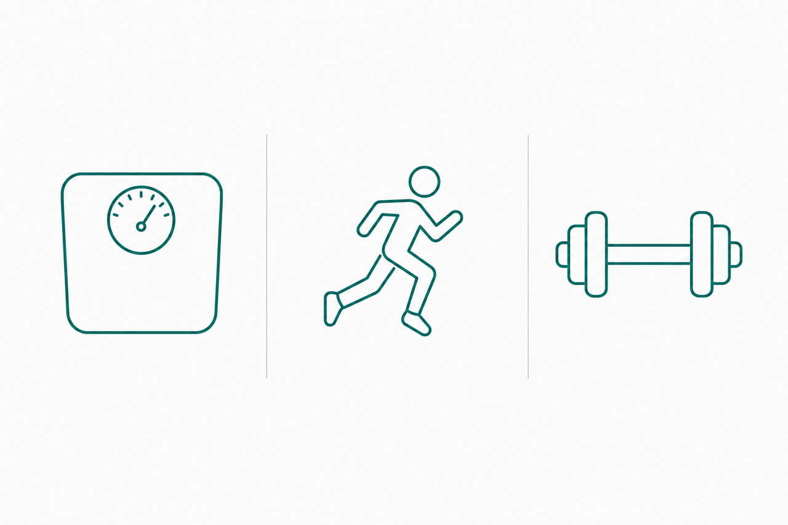
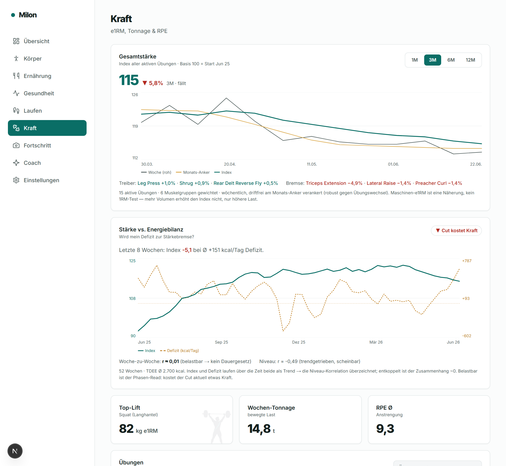
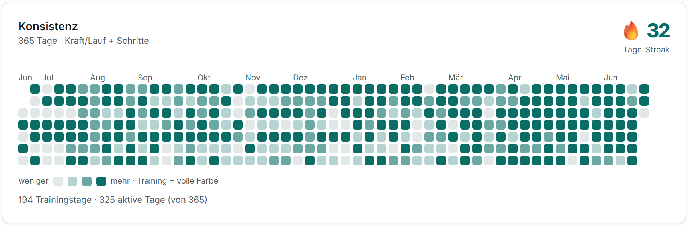
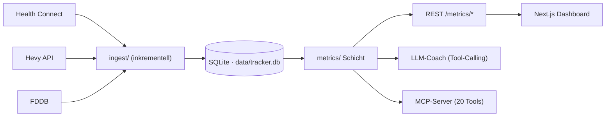

<p align="center">
  
</p>

<h1 align="center">Milon</h1>

<p align="center">
  <strong>Local-first personal fitness dashboard with an LLM coach.</strong><br>
  Eine Frage im Zentrum: <em>„Wo werde ich besser, wo schlechter?"</em>
</p>

<p align="center">
  
  
  
  
  
  
</p>

---

## Was macht das Projekt?

**Milon** zieht deine über viele Apps verstreuten Fitnessdaten an **einem** Ort zusammen —
Körperdaten, Schritte, Laufen & Radfahren (Health Connect), Krafttraining (**Hevy**) und
Ernährung (**FDDB**) — und beantwortet die eine Frage, die zählt: *werde ich besser oder
schlechter?* Vier Bereiche (**Körper · Laufen · Kraft** + ein **LLM-Coach**) zeigen Trends,
Prognosen und ehrliche Auswertungen.

Alles läuft **lokal** auf dem eigenen Rechner — die Gesundheitsdaten verlassen die Maschine nie.
UI deutsch, Code englisch. Bewusst schlank.

<p align="center">
  
</p>

## Screenshots

<p align="center">
  <br>
  <sub><b>Kraft-Analyse</b> — drift-freier Gesamtstärke-Index, Stärke ↔ Energiebilanz, Tonnage & RPE.</sub>
</p>

<p align="center">
  <br>
  <sub><b>Trainings-Konsistenz</b> (Übersicht) — GitHub-Style-Heatmap über 365 Tage + aktueller Streak.</sub>
</p>

## Welche Funktionen bietet es?

| Bereich | Highlights |
|---|---|
| **Übersicht** | Wochenvergleich (rollierende 7 Tage), Konsistenz-Heatmap + Streak, PR-Trophäen, letzte Aktivitäten |
| **Körper** | Gewichts-/KFA-Trends (roh · 7-Tage · EWMA), **adaptives TDEE**, Magermasse/Recomp, Komposition-Prognose |
| **Ernährung** | kcal **+ Makros** (Protein/KH/Fett), Protein Ø/Tag vs. Ziel, Defizit vs. TDEE |
| **Gesundheit** | Schritte (Galaxy-Watch-genau), Radfahren |
| **Laufen** | Wochenvolumen, Pace-Trend, VO₂max |
| **Kraft** | alle Übungen nach Muskelgruppe, e1RM/Tonnage/RPE, Übungs-Detailseiten, **drift-freier Gesamtstärke-Index**, **Stärke ↔ Energiebilanz** |
| **Fortschritt** | Foto-Timeline mit Browser-Crop (3:4) + Silhouetten-/Pose-Schablonen |
| **Coach** | LLM-Coach mit **Tool-Calling** (ruft die echten Kennzahlen selbst ab) + Kosten/Token-Statistik |
| **Einstellungen** | Keys maskiert, Modellwahl, Scheduler-Toggle |

Zwei analytische Schmuckstücke:

- **Gesamtstärke-Index** — *ein* Wert für „werde ich insgesamt stärker?". Wöchentlich aufgelöst und
  **drift-frei**: ein monatlicher, muskel-balancierter, verketteter e1RM-Index als Rückgrat plus eine
  monatsverankerte Wochenspur (Methodik per Design-Panel validiert & adversarial reviewed).
- **Stärke ↔ Energiebilanz** — korreliert den Index mit TDEE/Defizit und sagt *ehrlich*, was belastbar
  ist (Woche-zu-Woche ≈ 0) und was nur Schein-Trend (Niveau-Korrelation), plus ein Phasen-Read (Cut/Recomp).

## Wie ist die Architektur aufgebaut?

„Eine Abfrageschicht, drei Gesichter": die `metrics/`-Funktionen sind die einzige Wahrheit und
speisen REST, den Coach **und** den MCP-Server — alle lesen dieselbe lokale SQLite-DB.



- **Backend** `server/` — FastAPI · SQLModel/SQLite · pandas/numpy · APScheduler · FastMCP · OpenAI-SDK (OpenRouter)
- **Frontend** `client/` — Next.js 16 (App Router, TS) · Tailwind v4 · Inline-SVG-Charts (keine Chart-Lib)
- **Coach** — OpenRouter (OpenAI-kompatibel), Context-Injection **und** Tool-Calling
- **Design** `design/` — Studie „Klar & Klinisch" + gpt-image-2-Asset-Tooling

## Welche Datenquellen können angebunden werden?

| Quelle | Was | Wie / benötigte API |
|---|---|---|
| **Health Connect** (Android) | Gewicht, KFA, Schritte, Laufen, Radfahren, VO₂max | tägliche SQLite-Zip nach `data/incoming/` legen → inkrementeller Import (Phase 2: Drive-Pull) |
| **Hevy** | Krafttraining (Sätze, Gewicht, Reps, RPE) | offizielle [Hevy-API](https://api.hevyapp.com/docs/) (`HEVY_API_KEY`), echter Inkrement-Sync via `/v1/workouts/events` |
| **FDDB** | Ernährung (kcal + Makros) | Login-Cookie **`fddb`** (oder Auto-Login mit `FDDB_USER`/`FDDB_PW`), CSV-Export |
| **OpenRouter** | LLM-Coach | OpenAI-kompatibler Endpunkt (`OPENROUTER_API_KEY`, Modell frei wählbar) |

Alle Quellen sind **optional** — Milon läuft auch nur mit einer davon. Importe sind idempotent
(`?full=true` erzwingt eine Voll-Reconciliation).

## Wie erfolgt die Einrichtung?

### 1) Secrets anlegen

Vorlagen kopieren und echte Werte eintragen — die echten `.env` werden **nie** committet (gitignored):

```bash
cp .env.example .env                 # OPENAI_API_KEY (nur Design-Asset-Generierung)
cp server/.env.example server/.env   # App-Secrets (siehe Tabelle)
```

| Datei | Variable | Zweck |
|---|---|---|
| `server/.env` | `OPENROUTER_API_KEY` | LLM-Coach (OpenRouter) |
| | `OPENROUTER_MODEL` | Modell-ID, z. B. `deepseek/deepseek-v4-flash` |
| | `HEVY_API_KEY` | Hevy-Krafttraining-Sync |
| | `FDDB_USER` / `FDDB_PW` | FDDB-Auto-Login (Ernährung) |
| | `FDDB_COOKIE` | alternativ: `fddb`-Cookie (`userid,token`) |
| | `DATABASE_URL` | optional, Default `sqlite:///./data/tracker.db` |
| `.env` (Root) | `OPENAI_API_KEY` | nur für gpt-image-2-Design-Assets |
| `client/.env` | `NEXT_PUBLIC_API_URL` | optional (Default: `/api`-Proxy) |

### 2) Backend (FastAPI)

```bash
cd server
python -m venv .venv && .venv/Scripts/pip install -e .   # Linux/Mac: .venv/bin/pip
.venv/Scripts/python -m uvicorn app.main:app --host 0.0.0.0 --port 8000   # Docs: /docs
```

### 3) Frontend (Next.js)

```bash
cd client
npm install && npm run dev          # http://localhost:3000
```

In VS Code gibt es fertige Tasks (`Start: Server + Client`, `Design: HTML-Server`). Das Handy
erreicht das Dashboard im Heim-WLAN über `http://<PC-IP>:3000` — das Frontend proxyt `/api/*`
serverseitig ans Backend (kein CORS, keine Firewall-Freigabe für `:8000` nötig).

### 4) Daten importieren

```bash
curl -X POST http://localhost:8000/ingest/hevy            # Hevy
curl -X POST http://localhost:8000/ingest/fddb            # FDDB
# Health Connect: tägliche Export-Zip nach data/incoming/ legen, dann:
curl -X POST http://localhost:8000/ingest/health-connect
curl -X POST "http://localhost:8000/ingest/refresh"       # alle Quellen + Status
```

Ab Phase 2 erledigt das ein **Scheduler** automatisch (Hevy alle 6 h, FDDB täglich, HC-Ordner-Scan).

## Beispiel-Workflows

- **Frag deine Daten:** Reiter *Coach* → „Wie ist mein Kraft-Trend diese Woche?" — der Coach ruft
  per Tool-Calling die echten Kennzahlen ab und antwortet ehrlich-motivierend (Markdown).
- **Täglicher/Wöchentlicher Report:** ein Klick erzeugt einen kompakten Lagebericht; Kosten/Token
  werden je Report mitgeschrieben.
- **Stärke über Zeit:** Reiter *Kraft* → Gesamtstärke-Index mit Umschalter 1M/3M/6M/12M, dazu die
  Treiber-/Bremse-Übungen und die Stärke-↔-Energiebilanz-Karte.
- **Aus Claude/Cursor heraus (MCP):** der MCP-Server (`python -m app.mcp.server`, registriert über
  `.mcp.json`) exponiert 20 Tools über dieselbe Datenschicht — die Fitnessdaten lassen sich so direkt
  im Editor/Chat befragen.

## Projektstruktur

```
server/   FastAPI: ingest/ · metrics/ · coach/ · mcp/ · sync/ · api/
client/   Next.js: app/ (9 Seiten) · components/ · lib/
design/   „Klar & Klinisch"-Studie + Foto-Schablonen + Asset-Tooling
data/     tracker.db + incoming/ (lokal, gitignored)
docs/     README-Bilder
```

## Sicherheit & Privatsphäre

- **Secrets** liegen ausschließlich in `.env` (jede Ebene gitignored); committet werden nur die
  `*.env.example`-Vorlagen mit **leeren** Platzhaltern.
- **Gesundheitsdaten** (`data/`, `*.db`, Fortschritts-Fotos) sind gitignored und werden **nie** committet.
- Local-first: keine Cloud, keine Telemetrie. Der einzige ausgehende Aufruf ist der LLM-Coach
  (OpenRouter) — und nur, wenn du ihn nutzt.

## Lizenz

Veröffentlicht unter der **[CC0 1.0 Universal](LICENSE)** Public-Domain-Dedication — gemeinfrei,
ohne Gewährleistung. Du darfst alles damit machen: nutzen, ändern, weitergeben, auch kommerziell,
ohne Namensnennung. (Marken-/Patentrechte sind davon nicht berührt.)

## Status

Phasen **1–3** umgesetzt: Ingest + Metriken + Dashboards · Auto-Syncs (Scheduler) · MCP-Server.
Offen: **Phase 4** (Hosting) und optional ein echter Drive-Pull der Health-Connect-Zip.

<sub>Source of Truth für Architektur & Plan: <code>ARCHITECTURE.md</code>. Projekt-Memory: <code>CLAUDE.md</code>.</sub>
