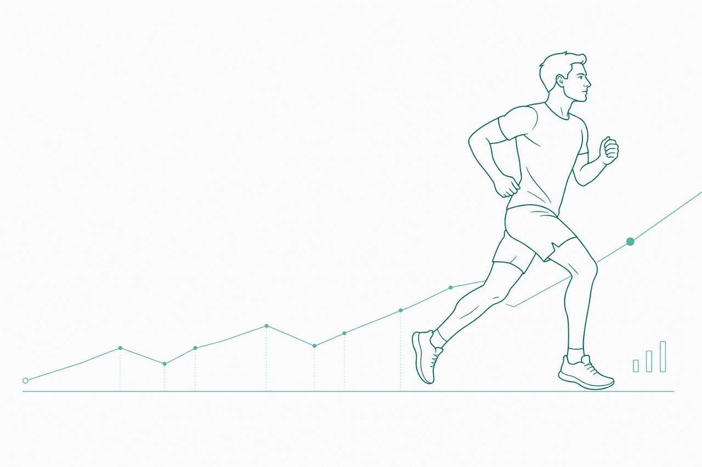
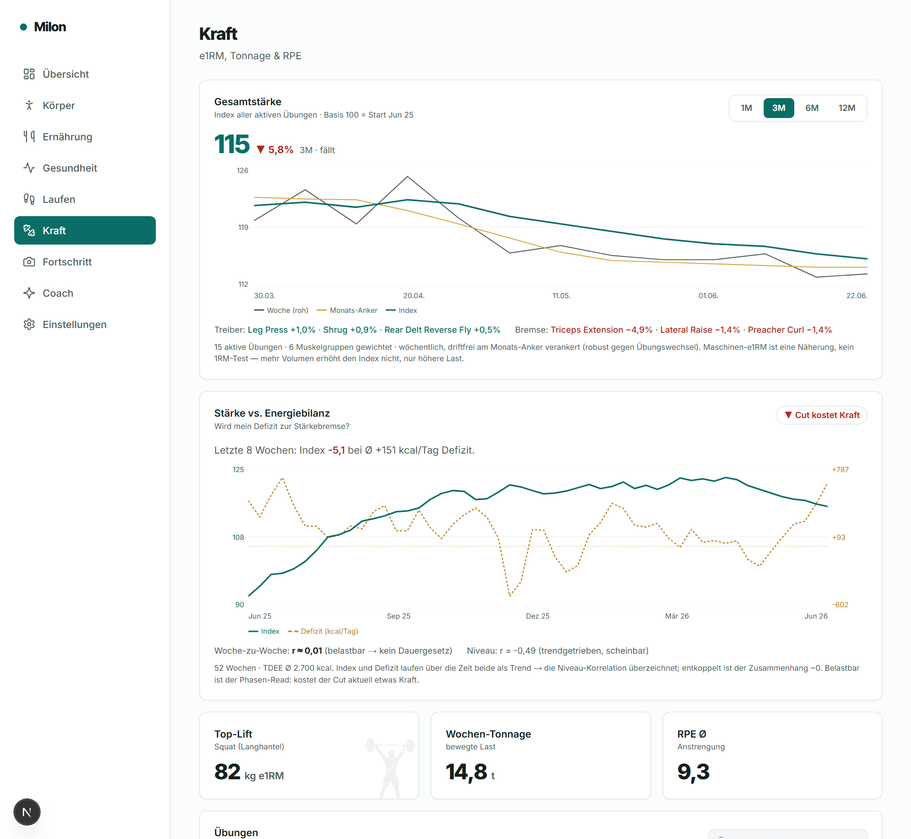
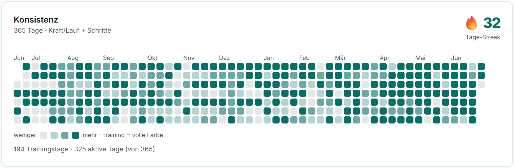
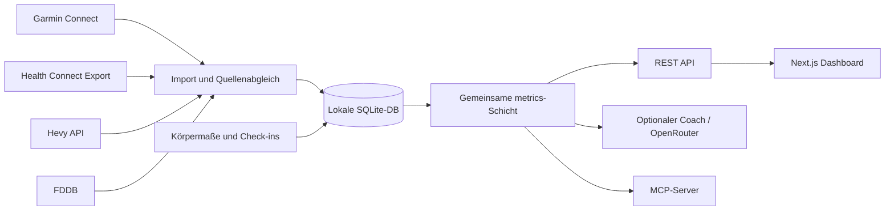

<p align="center">
  
</p>

<h1 align="center">Milon</h1>

<p align="center">
  <strong>Lokales Fitness-Dashboard mit optionalem LLM-Coach.</strong><br>
  Eine Frage im Zentrum: <em>„Wo werde ich besser, wo schlechter?“</em>
</p>

<p align="center">
  
  
  
  
  
  
</p>

## Was ist Milon?

Milon verbindet **Garmin Connect**, **Health Connect**, **Hevy** und **FDDB** in einer
lokalen SQLite-Datenbank. Körperentwicklung, Lauffitness und Kraftfortschritt stehen
im Mittelpunkt; Ernährung, Erholung und ein freiwilliger Check-in liefern Kontext.
UI und Dokumentation sind deutsch, Code und Identifier englisch.

Die Anwendung und ihre Auswertungen laufen lokal. Eingerichtete Datenquellen werden
über das Internet synchronisiert. Der **optionale Cloud-Coach** übermittelt Fragen,
persönlichen Kontext und ausgewählte Kennzahlen an OpenRouter und den Modellanbieter.
Details stehen unter [Datenschutz und Betrieb](#datenschutz-und-betrieb).

## Funktionen

| Bereich | Aktueller Funktionsumfang |
|---|---|
| **Übersicht** | Entwicklungskarten für Körper, Laufen und Kraft, visuelles Wochenjournal mit Training, Schlaf und Energie, Konsistenz, freiwilliger kurzer Check-in |
| **Körper** | Gemeinsamer Vergleich von Bauch/Taille, Gewicht und Kraftleistung; Gewichtstrends, TDEE, Waagen-KFA mit Einordnung, manuelle Körpermaße mit Messgrafik, historische Nachträge, Einzeltrends und Messjournal |
| **Laufen** | Streckenatlas mit automatisch gruppierten Runden, persönliche Referenzrunde, Wochenvolumen und mechanische Belastung, Pulszonen mit dynamischer Tempo-Spanne, Bestzeiten, standardisierter Puls bei gleicher Pace, experimenteller Fitness-Trend |
| **Einzelne Läufe** | Eigene Detailseite: Laufziel und Anstrengung, Stationswetter, Trainingsreiz, Pulsstabilität, gekoppelte Strecke und Puls-/Tempokurve, lokale Routenwiedergabe, Laufposter als PNG/SVG, Höhenprofil, Zonen, Runden, Laufstil früh/spät und automatischer statistischer Streckenvergleich |
| **Gesundheit** | Schritte, Radfahren, Schlaf, interaktive Nachtansicht mit Schlafphasen und Messreihen, Schlafrhythmus, HRV, Garmin-Erholungswerte, Zusammenhänge zwischen Erholung und Leistung sowie Quellen- und Importstatus |
| **Kraft** | Übungen nach Muskelgruppe, Detailseiten, e1RM, Tonnage, RPE, Gesamtstärke-Index und Zusammenhang mit der Energiebilanz |
| **Ernährung** | Kalorien, Makros, Proteinziel und Defizit gegenüber dem geschätzten TDEE |
| **Fortschritt** | Foto-Timeline, Zuschnitt, mehrere Ansichten und Silhouetten als Aufnahmehilfe |
| **Coach** | Kurze Antworten mit Kennzahlen, persönliche Ziele, ausdrücklich übernommene Wochenmaßnahme mit Rückmeldung und Messvergleich, lokale Diagramme, Berichte, Kostenübersicht und angeforderte Bildgenerierung |

Die Laufdetails öffnen über **Laufen → Dein Streckenatlas → Laufdetails** eine eigene
Adresse `/laufen/<Garmin-Aktivitäts-ID>`. Die wichtigsten Einordnungen stehen oben;
die Analysen darunter sind direkt sichtbar. Methodik und Datenbasis bleiben einklappbar.

- **Streckenatlas:** Wiederholungen werden mit mindestens 97 % Überdeckung einer
  festen Referenzstrecke zugeordnet. Konturen und Verlauf bleiben lokal; die
  Laufdetails bieten eine abspielbare Position mit synchronen Messwerten.
- **Laufposter:** Drei Farbstile und sechs Ink-/Teal-Motive, mit echter Strecke
  und Laufwerten als 1024 × 1024 PNG oder SVG. Der Export entsteht im Browser.
- **Deine Nacht:** Schlafphasen und bis zu zwei auswählbare Verläufe (Puls, Stress,
  Body Battery, HRV) teilen eine Zeitachse. Die 14-/30-Tage-Ansicht zeigt den
  Schlafrhythmus; unvollständige Phasen und Messlücken bleiben erkennbar.
- **Laufstil und Belastung:** Frühe/späte Minuten werden bei ähnlichem Tempo und
  Gefälle verglichen, unter anderem für Schrittbremsung (SSL%), Bodenkontakt und
  Kadenz. Wochenbalken trennen gelaufene Kilometer von Garmins Impact Load;
  Hevy-Beintage erscheinen separat. Lauftoleranz wird nur gezeigt, wenn Garmin
  geeignete Werte liefert. [Methodik](docs/research/garmin-running-mechanics.md).
- **Wochenjournal:** Sieben abgeschlossene lokale Kalendertage mit Läufen,
  Krafttraining, Hauptschlaf und freiwilliger Energieangabe. Frühere Zeiträume
  lassen sich wochenweise aufrufen; fehlende Messwerte bleiben offen.

- **Referenzrunde:** In den Laufdetails eine Runde auswählen. Die Laufübersicht sammelt
  passende Wiederholungen derselben Sensorperiode und Richtung. Einzelne Pulsunterschiede
  beschreiben Beobachtungen; sie beweisen keine Fitnessveränderung.
- **Läufe vergleichen:** Automatisch alle anderen passenden Läufe derselben Sensorperiode
  mit mindestens 97 % Streckenüberdeckung (30 m GPS-Toleranz, gleiche Richtung und ähnliche
  Länge). Pace und Puls zeigen Einzelwerte, Median und Spanne; ab fünf Vergleichswerten
  zusätzlich die mittleren 50 %. Der ausgewählte Lauf bleibt außerhalb der Verteilung.
  [Methodik und Grenzen](docs/research/run-cohort-comparison.md).
- **Körperfortschritt:** 4, 8 oder 12 Wochen auswählen. Die ersten und letzten 14 Tage
  bilden gemeinsame Vergleichsfenster für Bauch/Taille, Gewichtsmittel und gleiche Übungen.
- **Wochenmaßnahme:** Unter Coach eine konkrete Handlung ausdrücklich übernehmen,
  optional einen Messwert auswählen und später kurz rückmelden. Der Coach kann bestehende
  Maßnahmen lesen; anlegen oder ändern kann sie nur der Nutzer.

Garmin-Stationswetter ergänzt Laufdetails mit Temperatur, Feuchte,
Windrichtung und Messzeit. Die Windgeschwindigkeit bleibt wegen fehlender belegter
API-Einheit ausgenommen. Wetter verändert keine berechnete Pace oder Pulsdifferenz.

Auswertungen kennzeichnen fehlende Daten und Unsicherheit. Sensorwechsel werden
berücksichtigt; ältere Werte werden nicht als aktuelle Fitness ausgegeben. Ein
niedriger Trainingsreiz ist nicht automatisch schlecht, eine Korrelation kein
Kausalnachweis. Körperumfänge werden nicht in einen vermeintlich exakten KFA umgerechnet.

### Design

„Klar & Klinisch“: Teal, ruhige Karten, Inter / Inter Tight und abstrakte Sportler-Silhouetten.
Die folgenden Bilder zeigen frühere Ansichten; der heutige Funktionsumfang ist größer.

<p align="center">
  <br>
  
</p>

## Datenquellen und ihre Aufgaben

| Quelle | Verwendung | Anbindung |
|---|---|---|
| **Garmin Connect** | Laufstrecken, Puls-/Temporeihen, Runden, Laufdynamik und Trainingswirkung; Schritte, Schlaf, HRV, VO₂max und verfügbare Erholungswerte | Direkter Import über die **inoffizielle** Bibliothek `garminconnect`, lokale Sitzung erforderlich |
| **Health Connect** | Arboleaf-Gewicht und Waagen-KFA, historische Samsung-Daten und weitere unterstützte Exportdaten | Entpackte SQLite-Exportdatei oder optional täglicher Drive-Pull |
| **Hevy** | Gym-Workouts mit Sätzen, Gewichten, Wiederholungen und RPE | [Hevy-API](https://api.hevyapp.com/docs/), `HEVY_API_KEY` |
| **FDDB** | Kalorien und Makros | Zugangsdaten für Auto-Login oder vorhandener `fddb`-Cookie |
| **Manuelle Eingaben** | Körperumfänge, Fortschrittsfotos, Check-ins und persönliche Ziele | Direkt in Milon |

Die Quellen sind optional. Bei eingerichteter Garmin-Quellenumschaltung haben
vollständige Garmin-Läufe sowie geeignete Schritte-, Schlaf- und VO₂max-Daten ab
dem Stichtag Vorrang. Gespiegelte HC-Aktivitäten werden abgeglichen; historische
Daten bleiben erhalten. **Garmin-Ruhepuls bleibt getrennt** vom bisherigen HC-Wert,
da Definition und zeitliche Zuordnung noch nicht abschließend übereinstimmen.
Arboleaf bleibt über Health Connect angebunden, Kraft über Hevy und Ernährung über FDDB.

## Schnellstart mit Docker

Voraussetzung: Docker mit Compose, unter Windows beispielsweise Docker Desktop.
Im Hauptverzeichnis eine `server/.env` aus der Vorlage anlegen, falls noch keine existiert:

```powershell
if (-not (Test-Path server/.env)) { Copy-Item server/.env.example server/.env }
docker compose up -d --build
```

Anschließend **http://localhost** öffnen, im vertrauten Heimnetz `http://<PC-IP>`.
Die API ist über `/api` erreichbar, ihr Schema unter `/api/openapi.json`.

- Nur das Frontend veröffentlicht einen Port: **80**, über `WEB_PORT` in der Root-`.env` änderbar.
- Das Backend ist ausschließlich im Compose-Netz auf Port 8000 erreichbar.
- `data/` und `server/.env` liegen als Volumes auf dem Host. DB, Fotos, Coach-Bilder
  und Garmin-Sitzung bleiben bei einem Rebuild erhalten.
- Nach Änderungen: `docker compose up -d --build`. Ein vorheriges `down` ist unnötig.
- Status: `docker compose ps`; Logs: `docker compose logs --tail 50`.

Das Proxy-Ziel wird beim Frontend-Build eingebaut (`API_PROXY_TARGET=http://server:8000`).
Bei Änderungen an Code oder Zieladresse ist ein Rebuild erforderlich.

### Konfiguration

| Datei | Wichtige Einstellungen |
|---|---|
| `server/.env` | `OPENROUTER_API_KEY`, `OPENROUTER_MODEL`, `HEVY_API_KEY`, `FDDB_USER` / `FDDB_PW` oder `FDDB_COOKIE`, optional `HC_DRIVE_FILE_ID` |
| `server/.env` | `WATCH_SOURCE_SWITCH_DATE`, `WATCH_SOURCE_PACKAGE` und historische `STEPS_SOURCE_PACKAGE`; `BODY_SOURCE_PACKAGE` für die Waagenquelle; `RUN_HR_MAX` für Milons Zonen |
| `server/.env` | Optional `DATABASE_URL`, `SCHEDULER_ENABLED`, `TIMEZONE` (Default `Europe/Berlin`) |
| `data/garmin/.env` | `GARMIN_SESSION_B64` mit der lokal erzeugten Garmin-Sitzung |
| `.env` im Hauptverzeichnis | Optional `WEB_PORT`; `OPENAI_API_KEY` nur für separate Design-Asset-Werkzeuge |
| `client/.env` | Nur lokale Entwicklung: optional `NEXT_PUBLIC_API_URL`; normalerweise bleibt der relative `/api`-Proxy aktiv. Docker übernimmt diese Datei nicht. |

Die Vorlage verwendet derzeit `openai/gpt-6-luna` als Coach-Modell. Modell, API-Key
und persönliche Coach-Ziele lassen sich in den Einstellungen ändern. Ein OpenRouter-Key
ist nur für Coach-Funktionen nötig, nicht für die lokalen Kennzahlen.
Die vollständigen Defaults stehen in [config.py](server/app/config.py).

### Garmin verbinden und aktualisieren

Der Importer verwendet eine bereits authentifizierte Sitzung in `data/garmin/.env`.
`GARMIN_SESSION_B64` enthält Base64-kodiertes JSON mit `di_token`, `di_refresh_token`
und `di_client_id`. Das ist **keine Verschlüsselung**; die Datei ist ein Zugangsschlüssel.
Erneuerte Tokens werden atomar gespeichert, ein Garmin-Passwort speichert Milon nicht.

**Einrichtungsstand:** Das Repository enthält derzeit keinen Erstlogin-Assistenten
und keinen Login-CLI-Befehl. Die Sitzung muss außerhalb der App erzeugt werden.
Die technische Grundlage und Grenzen beschreibt die
[Garmin-Recherche](docs/research/garmin-direct-data.md); das erwartete Format steht im
[Importer](server/app/ingest/garmin.py). Die Anbindung nutzt Garmin-Consumer-Dienste,
nicht das offizielle Garmin-Entwicklerprogramm.

Mit vorhandener Sitzung: **Garmin aktualisieren** auf der Laufseite oder **Daten
aktualisieren** im Menü. Per API im Docker-Betrieb:

```powershell
curl.exe -X POST http://localhost/api/ingest/garmin
```

Die Uhr muss zuvor mit Garmin Connect synchronisiert haben. Der Erst-/Vollabruf
prüft höchstens 1.000 Laufaktivitäten, Folgeabrufe die letzten 30. Neue Tagesdaten
werden ab dem konfigurierten Uhrenwechsel zunächst über maximal 90 Tage eingelesen.
Verfügbarkeit einzelner Werte hängt von Aufzeichnung, Gerät und Garmin ab.
Für die Garmin-Quellenumschaltung `WATCH_SOURCE_PACKAGE` auf
`com.garmin.android.apps.connectmobile` setzen und unter `WATCH_SOURCE_SWITCH_DATE`
das tatsächliche Wechseldatum im Format `YYYY-MM-DD` eintragen.

### Health Connect importieren

Beim manuellen Weg die Export-ZIP **entpacken** und die Datei als
`data/incoming/health_connect_export.db` ablegen. Eine unbearbeitete ZIP in diesem
Ordner reicht nicht aus. Danach im Menü aktualisieren oder:

```powershell
curl.exe -X POST http://localhost/api/ingest/health-connect
```

Der optionale Drive-Pull lädt eine freigegebene Export-ZIP über `HC_DRIVE_FILE_ID`,
entpackt und importiert sie. Die Freigabe macht Gesundheitsdaten für Personen mit
dem Link zugänglich. Die Datei-ID muss stabil bleiben; ein täglich neu angelegtes
Drive-Dokument wird nicht automatisch anhand seines Namens gefunden.
Milon liest Health Connect weiterhin über diesen Export, nicht direkt vom Android-Gerät.

### Automatische Aktualisierung

Bei aktiviertem Scheduler gelten folgende Intervalle in der konfigurierten Zeitzone:

| Quelle | Zeitplan |
|---|---|
| Garmin | Prüfung alle 15 Minuten; Tageswerte höchstens stündlich, manueller Refresh sofort |
| Hevy | Alle 6 Stunden |
| FDDB | Täglich 04:30 |
| Health Connect, lokale Datei | Prüfung alle 10 Minuten bei neuer Datei |
| Health Connect, Drive | Täglich 05:00, wenn eingerichtet |

`POST /api/ingest/refresh` aktualisiert alle eingerichteten Quellen. Importe gleichen
vorhandene Datensätze ab; `?full=true` erzwingt eine weitergehende Reconciliation im
jeweiligen Importumfang. Die Quellenübersicht auf **Gesundheit** trennt letzten
Abrufversuch, erfolgreichen Abruf und neuestes Messdatum.

## Lokal entwickeln

Voraussetzungen: Python 3.12 oder neuer und Node.js 22. `server/.env` wie oben anlegen.
Unter Windows in zwei Terminals:

```powershell
cd server
python -m venv .venv
.venv/Scripts/python -m pip install -e ".[dev]"
.venv/Scripts/python -m uvicorn app.main:app --reload --host 0.0.0.0 --port 8000
```

```powershell
cd client
npm ci
npm run dev
```

Unter Linux/macOS heißen die Python-Pfade `.venv/bin/python`. Das Dashboard läuft im
Dev-Modus unter http://localhost:3000 und leitet `/api` an Port 8000 weiter.
Die interaktive API-Dokumentation läuft dann direkt unter http://localhost:8000/docs.
VS Code bietet dafür den Task **Start: Server + Client**.

Prüfungen: im Serververzeichnis `.venv/Scripts/python -m pytest`, im Clientverzeichnis
`npm test`, `npx tsc --noEmit` und `npm run build`.

## Architektur und MCP


```mermaid
flowchart LR
  GC["Garmin Connect"] --> ING
  HC["Health Connect Export"] --> ING
  HV["Hevy API"] --> ING
  FD["FDDB"] --> ING
  ING["Import und Quellenabgleich"] --> DB[("Lokale SQLite-DB")]
  MAN["Körpermaße und Check-ins"] --> DB
  DB --> M["Gemeinsame metrics-Schicht"]
  M --> REST["REST API"]
  REST --> UI["Next.js Dashboard"]
  M --> CO["Optionaler Coach / OpenRouter"]
  M --> MCP["MCP-Server"]
```

FastAPI, SQLModel, pandas/numpy und APScheduler bilden das Backend. Das Frontend
verwendet Next.js mit App Router, TypeScript, Tailwind v4 und lokalen SVG-Diagrammen.
REST, Coach und MCP greifen auf dieselben Metrikfunktionen zu.

Der MCP-Server startet im Serververzeichnis mit `.venv/Scripts/python -m app.mcp.server`
über stdio (Linux/macOS: `.venv/bin/python -m app.mcp.server`).
Er läuft außerhalb von Docker und liest dieselbe lokale Datenbank. Die
[.mcp.json](.mcp.json) und das [Desktop-Beispiel](server/app/mcp/claude_desktop_config.example.json)
enthalten installationsspezifische absolute Pfade; vor Verwendung anpassen.

```text
server/   API, Importe, Metriken, Coach, MCP und Scheduler
client/   Dashboard, Detailseiten und gemeinsame UI-Komponenten
design/   Design-Referenzen, Silhouetten und Asset-Werkzeuge
data/     DB, Exporte, Fotos, Coach-Bilder und Garmin-Sitzung; gitignored
docs/     Dokumentation, Recherche und README-Bilder
```

## Datenschutz und Betrieb

- Gesundheitsdaten und Zugangsdaten unter `data/` sowie `.env`-Dateien werden nicht committet.
  Ein lokales Backup sollte neben der DB auch Fotos und Konfiguration umfassen und geschützt sein.
- Eingerichtete Syncs kontaktieren Garmin, Hevy, FDDB und gegebenenfalls Google Drive.
- Der optionale Coach sendet Fragen, Kontext und ausgewählte Metriken/Tool-Ergebnisse
  an OpenRouter und den gewählten Modellanbieter. Prompts und Antworten werden lokal gespeichert.
- Coach-Diagramme werden aus validierten lokalen Daten gerendert, nicht aus beliebigem
  Modell-HTML. Explizit angeforderte Bilder verwenden OpenRouter und den Motivprompt.
- GPS-Strecken werden lokal ohne externe Kartenkacheln dargestellt; Coach-Tools geben
  keine GPS-Koordinaten aus. Ein angeschlossener MCP-Client erhält die angefragten Metriken.
- Milon hat keine Nutzeranmeldung. Das Setup ist für den eigenen Rechner und ein
  vertrautes Heimnetz gedacht; öffentlicher Betrieb braucht zusätzlichen Zugriffsschutz.

## Weiterführendes

[ARCHITECTURE.md](ARCHITECTURE.md) beschreibt Methoden, Datenmodell und Quellenregeln.
[AGENTS.md](AGENTS.md) hält die Arbeitskonventionen fest. Ideen für weitere Schritte:
[Laufen](docs/research/running-next-steps.md) und
[Körperentwicklung, Erholung und Coach](docs/research/fitness-next-steps.md).
Referenzrunde, Laufabsicht, Stationswetter, gemeinsamer Körpervergleich und
Wochenmaßnahmen sind umgesetzt; die Notizen nennen auch weiter offene Vorschläge.

## Lizenz

[CC0 1.0 Universal](LICENSE): frei nutzbar, veränderbar und weitergebbar, ohne Gewährleistung.
